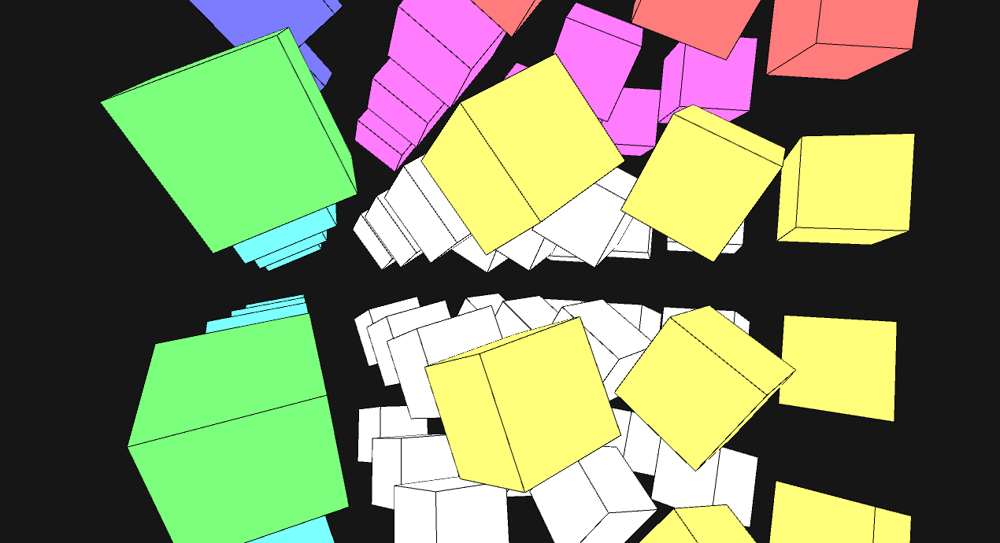

#Colorful cubes in a grayscale world

Demoscene "demo" entry coded and published at http://graffathon.fi/ 2015

Coded with Processing and GLSL Shaders. To run, open with [Processing](http://processing.org/) version 2.x and run.

